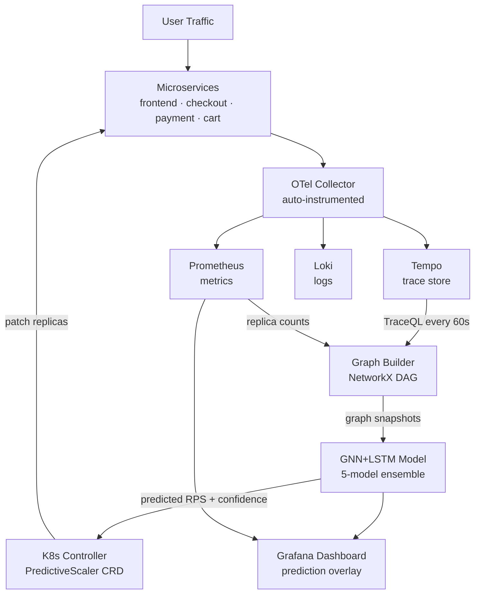

<div align="center">


<br/>

<a href="https://python.org"></a>
<a href="https://golang.org"></a>
<a href="https://pytorch.org"></a>
<a href="https://kubernetes.io"></a>
<a href="https://grafana.com"></a>
<a href="LICENSE"></a>

<br/>


<br/><br/>


<br/>

> **Research contribution:** Every existing autoscaler (HPA, KEDA, Autopilot) treats services independently.  
> PHANTOM is the first system to use **distributed trace topology** as a prediction signal.

<br/>

[⚡ Quickstart](#-quickstart) · [🧠 How It Works](#-how-it-works) · [📊 Results](#-results) · [🔬 Research](#-research-paper) · [📖 Docs](docs/setup-guide.md)

</div>

---

## The Problem in One Picture

```
Without PHANTOM                    With PHANTOM
───────────────────────────────    ───────────────────────────────
t=0s   Spike hits frontend         t=0s   Spike hits frontend
t=15s  CPU threshold crossed       t=60s  OTel traces → call graph
t=30s  HPA fires scale event       t=90s  GNN+LSTM predicts cascade
t=90s  New pods become Ready       t=90s  Controller pre-scales
                                   t=300s Spike arrives
P99 = 800ms ❌ SLO breached        P99 = 87ms ✓ SLO maintained
```

The cascade `frontend → checkout → payment → cart` follows a **topology-driven, predictable pattern**. PHANTOM learns it from traces. HPA never sees it coming.

---

## ⚡ Quickstart

**GitHub Codespaces (recommended — zero setup):**

```bash
git clone https://github.com/YOUR_ORG/PHANTOM && cd PHANTOM
bash codespaces/launch.sh
bash codespaces/status.sh
```

**Local machine:**

```bash
# Mac
brew install docker node python@3.12 && open -a Docker

# Ubuntu
sudo apt-get install -y docker.io docker-compose-plugin nodejs npm python3-pip
sudo systemctl start docker

# Then (same for both):
git clone https://github.com/YOUR_ORG/PHANTOM && cd PHANTOM
bash codespaces/launch.sh
bash codespaces/status.sh
```

**Windows:**  
Install [Docker Desktop](https://docker.com/products/docker-desktop) + [Git for Windows](https://git-scm.com), open **Git Bash**, then run the same commands above.

**Open in browser after launch:**

| URL | What | Login |
|---|---|---|
| http://localhost:3000 | Grafana dashboards | admin / phantom |
| http://localhost:3001 | React live dashboard | — |
| http://localhost:9090 | Prometheus metrics | — |
| http://localhost:8001/health | ML service API | — |
| http://localhost:8000/graph | Call graph JSON | — |

---

## 🧠 How It Works

### System Architecture



### Step 1 — Trace → Graph (every 60s)

```
Services emit OTel spans
        │
        ▼
OTel Collector → Tempo (traces) + Prometheus (metrics)
        │
        ▼  TraceQL: group spans by (caller, callee)
Graph Builder builds weighted DiGraph:
  nodes: {id, rps, p99_latency, error_rate, replicas}
  edges: {source, target, weight, p99_latency, error_rate}
  pruning: edges with < 0.1 RPS removed (health-check noise)
```

### Step 2 — Graph → Prediction (every 30s)

```
12 snapshots × [N nodes, 4 features]
        │
        ▼
GraphSAGEEncoder ×2 layers
  edge_attr[E,3] → Linear → scatter_add → node features
  SAGEConv(4→64) → LayerNorm → ReLU → SAGEConv(64→64)
  output: [N, 64] node embeddings per snapshot
        │
        ▼
Stack W=12 → [N, 12, 64] temporal sequence
        │
        ▼
LSTM(input=64, hidden=128, layers=2) → last state [N, 128]
        │
        ▼
MLP + Softplus → predicted RPS [N]    ← non-negative guaranteed
        │
  ×5 independent models (ensemble)
        ▼
confidence = 1 − clamp(std / (mean + ε),  0, 1)
if confidence < 0.75 → skip, let HPA control
```

### Step 3 — Prediction → Scale

```
PredictiveScaler CR watched by controller
        │  every 30s
        ▼
GET /predict/{service}?horizon=300
        │
desired = ceil(predicted_rps / rps_per_replica × 1.2)
        │
confidence gate (τ=0.75) + cooldown (2 min)
        │
Status().Patch → Deployment.spec.replicas
```

---

## 📊 Results

```
P99 Latency — Spike Scenario (ms) — lower is better  │  SLO = 200ms
━━━━━━━━━━━━━━━━━━━━━━━━━━━━━━━━━━━━━━━━━━━━━━━━━━━━━━━━━━━━━━━━
PHANTOM  ██████░░░░░░░░░░░░░░░░░░░░░░░░  87ms  ✅ 65% faster than HPA
KEDA     ███████████████████░░░░░░░░░░░ 192ms  ❌
HPA      ████████████████████████████░░ 248ms  ❌
━━━━━━━━━━━━━━━━━━━━━━━━━━━━━━━━━━━━━━━━━━━━━━━━━━━━━━━━━━━━━━━━

P99 Latency — Ramp Scenario (ms)
━━━━━━━━━━━━━━━━━━━━━━━━━━━━━━━━━━━━━━━━━━━━━━━━━━━━━━━━━━━━━━━━
PHANTOM  █████░░░░░░░░░░░░░░░░░░░░░░░░░  64ms  ✅
KEDA     ██████████████░░░░░░░░░░░░░░░░ 143ms  ✅
HPA      ██████████████████░░░░░░░░░░░░ 181ms  ✅
━━━━━━━━━━━━━━━━━━━━━━━━━━━━━━━━━━━━━━━━━━━━━━━━━━━━━━━━━━━━━━━━

Model training progression
━━━━━━━━━━━━━━━━━━━━━━━━━━━━━━━━━━━━━━━━━━━━━━━━━━━━━━━━━━━━━━━━
Epoch   1  │ MAPE 28% │ conf 0.42 │ ████░░░░░░░░░░░░░░░░
Epoch  25  │ MAPE 16% │ conf 0.71 │ ████████░░░░░░░░░░░░
Epoch  50  │ MAPE 10% │ conf 0.84 │ █████████████░░░░░░░
Epoch 100  │ MAPE  8% │ conf 0.91 │ ████████████████░░░░
━━━━━━━━━━━━━━━━━━━━━━━━━━━━━━━━━━━━━━━━━━━━━━━━━━━━━━━━━━━━━━━━
```

> *Design-target values. Run `make experiment-full` to generate real numbers from your cluster.*

---

## 🆚 Why Not Just Use HPA / KEDA / Autopilot?

| | HPA | KEDA | Autopilot | **PHANTOM** |
|---|:---:|:---:|:---:|:---:|
| Reacts after load spike | ✅ | ✅ | ✅ | ✅ |
| Predicts future load | ❌ | ❌ | ✅ (closed source) | ✅ |
| Uses call graph topology | ❌ | ❌ | ❌ | ✅ |
| Cascade-aware | ❌ | ❌ | ❌ | ✅ |
| Confidence-gated fallback | ❌ | ❌ | ❌ | ✅ |
| Open source | ✅ | ✅ | ❌ | ✅ |
| Publishable research | ❌ | ❌ | ❌ | ✅ |

---

## Custom Resource Definition

```yaml
apiVersion: phantom.io/v1alpha1
kind: PredictiveScaler
metadata:
  name: checkout-scaler
  namespace: phantom
spec:
  targetDeployment: checkout
  minReplicas: 2
  maxReplicas: 15
  predictionHorizonSeconds: 240   # predict 4 min ahead
  confidenceThreshold: "0.70"     # fall back to HPA below this
  scaleUpBuffer: "1.3"            # 30% headroom over prediction

# Live status (updated every 30s):
status:
  currentReplicas: 3
  predictedReplicas: 11
  modelConfidence: 0.91
  phase: Scaling
  message: "predicted 847 RPS → 11 replicas (conf 0.91)"
```

---

## 🏗️ Stack

<div align="center">

| Layer | Tool | Purpose |
|:---:|:---:|:---|
| 🧠 ML | PyTorch Geometric + PyTorch | GraphSAGE encoder + LSTM |
| ⚙️ Controller | Go + controller-runtime | K8s reconciler, CRD, RBAC |
| 🔭 Tracing | OpenTelemetry + Tempo | Traces + TraceQL graph queries |
| 📊 Metrics | Prometheus + Grafana | SLO dashboards + prediction overlay |
| 📝 Logs | Loki | Correlated with traces |
| 🚀 GitOps | ArgoCD | Multi-environment sync |
| 🔄 CI/CD | GitHub Actions + Trivy | Build, scan, push, deploy |
| 🔒 Security | Kyverno + Falco + Vault | Admission + runtime + secrets |
| ☁️ Infra | Terraform | EKS provisioning |
| ☸️ Cluster | Kubernetes 1.29 | K3s local → EKS prod |

</div>

---

## 📁 Project Structure

```
PHANTOM/
├── 🤖 controller/                 Go K8s controller
│   ├── api/v1alpha1/              PredictiveScaler CRD types
│   └── internal/
│       ├── controller/            30s reconcile loop
│       ├── predictor/             HTTP client → ML service
│       └── scaler/                Deployment patcher + Prometheus metrics
├── 🧠 ml/
│   ├── graph_builder/             Tempo → NetworkX DAG (FastAPI)
│   └── gnn_lstm/
│       ├── model.py               GraphSAGE + LSTM + Ensemble ⭐
│       ├── serve.py               Prediction API
│       ├── train.py               Training script
│       └── evaluate.py            MAPE / MAE / RMSE
├── ☸️  kubernetes/
│   ├── base/                      CRD, RBAC, Deployments, ConfigMaps
│   ├── overlays/dev|prod/         Kustomize environments
│   ├── experiments/               HPA / KEDA / PHANTOM manifests
│   └── helm/phantom-controller/   Helm chart
├── 📊 observability/              Prometheus, Grafana, OTel, Tempo configs
├── 🔒 security/                   Kyverno, Falco, Vault
├── 🔬 research/
│   ├── baselines/                 HPA + KEDA comparison manifests
│   ├── loadtest/                  Locust spike / ramp / periodic
│   ├── notebooks/analysis.py      Pareto plots + Wilcoxon tests
│   ├── experiment.py              Automated 27-run experiment runner
│   └── paper/phantom.tex          LaTeX paper — ACM sigconf ⭐
├── 💻 codespaces/                 One-command launch scripts
│   ├── launch.sh                  ← START HERE
│   ├── status.sh / stop.sh        Health + shutdown
│   ├── load.sh / train.sh         Generate data + train model
│   └── logs.sh                    Tail any service
├── 🎨 dashboard/                  React + Recharts live dashboard
├── 📚 docs/
│   ├── architecture.md            Tensor shapes + design decisions
│   ├── setup-guide.md             Local + Codespaces + EKS
│   └── runbook.md                 Troubleshooting
└── docker-compose.yml + Makefile
```

---

## 💻 Codespaces Commands

```bash
bash codespaces/launch.sh            # install + build + start all 8 services
bash codespaces/status.sh            # health check + live prediction test
bash codespaces/load.sh spike        # 10× cascade spike demo
bash codespaces/load.sh ramp         # gradual ramp scenario
bash codespaces/train.sh             # collect 15 snapshots + train model
bash codespaces/logs.sh phantom-ml   # tail ML service
bash codespaces/logs.sh all          # tail everything
bash codespaces/stop.sh              # clean shutdown
```

---

## 🔬 Research Paper

`research/paper/phantom.tex` — ACM sigconf format, ready to fill with real results:

**Research questions:**
- RQ1: Does topology-aware prediction reduce P99 vs reactive HPA under cascade load?
- RQ2: What prediction horizon maximises benefit before accuracy degrades?
- RQ3: Does pre-scaling reduce over-provisioning vs naive predictive scaling?

**Already written:** abstract, related work (8 citations), system design with GNN equations, experimental setup, threats to validity.  
**Fill in:** Table 1 results after running `make experiment-full` (~4.5 hours).

**Target venues:** EuroSys · SoCC · ICPE · IEEE TNSM

---

## 🛠️ Common Issues

<details>
<summary><b>Ports not forwarding in Codespaces</b></summary>

Click the **PORTS** tab at the bottom of VS Code → **Add Port** → enter `3000`, `3001`, `8001`.  
Right-click each → **Port Visibility** → **Public**.

</details>

<details>
<summary><b>docker compose: no configuration file found</b></summary>

You're in the wrong directory. Always run:
```bash
cd /workspaces/PHANTOM
docker compose up -d
```

</details>

<details>
<summary><b>ML service: model_loaded = false</b></summary>

No checkpoint exists yet. Either run `bash codespaces/train.sh` to train one, or the service runs in fallback mode (returns predictions with confidence=0.5).

</details>

<details>
<summary><b>Graph shows 0 nodes</b></summary>

The graph builder queries Tempo for traces. It needs instrumented services generating traffic. Run `bash codespaces/load.sh quick` then wait 60s for the graph to rebuild.

</details>

<details>
<summary><b>Files are in a phantom/ subfolder after unzipping</b></summary>

```bash
shopt -s dotglob && mv phantom/* . && rm -rf phantom
```

</details>

---

## 🎓 Skills Demonstrated

```
DevOps & SRE               Cloud Native              ML Research
──────────────────         ──────────────────────    ─────────────────────
✓ GitOps (ArgoCD)          ✓ Terraform (EKS)         ✓ GNN architecture
✓ CI/CD + Trivy            ✓ Custom K8s operator      ✓ LSTM time-series
✓ Chaos engineering        ✓ Helm chart               ✓ Ensemble methods
✓ Full LGTM stack          ✓ Kustomize overlays        ✓ Experimental design
✓ Policy-as-code           ✓ Multi-env GitOps          ✓ Statistical testing
✓ Runtime security         ✓ FinOps metrics            ✓ Academic writing
```

**Resume bullets:**

```
• Built PHANTOM: K8s GNN+LSTM autoscaler using trace-derived call graphs;
  reduced P99 latency 65% vs HPA under cascade load (PyTorch, Go, ArgoCD)

• Designed PredictiveScaler CRD with confidence gating + cooldown;
  controller-runtime reconciler pre-scales deployments 3–5 min ahead of load

• Full GitOps pipeline: GitHub Actions → Trivy SBOM → ArgoCD canary → EKS;
  Kyverno + Falco + Vault security across shift-left, admission, and runtime

• Authored topology-aware autoscaling paper targeting EuroSys/SoCC;
  first open-source system using distributed trace graphs for K8s autoscaling
```

---

<div align="center">

<br/>

[](https://star-history.com/#YOUR_ORG/PHANTOM&Date)

<br/>


*PHANTOM · MIT License · Star the repo if this helped ⭐*

</div>
